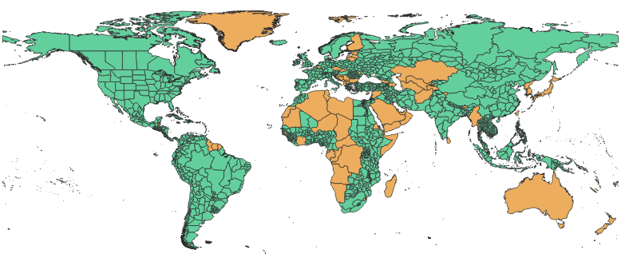

# GloVuln

## Introduction
The **Glo**bal **Vuln**erability to Natural Disasters (**GloVuln**) contains global dataset and composite vulnerability to natural disasters, such as floods, droughts, earthquakes, etc.
- The main objective is to construct datasets for high resolution vulnerability analysis to natural disasters.
- The second objective is visualize individual indicator and composite vulnerability which can be weighted by users (e.g., aid agency) in browser and obtain their preferences through online surveys.

## Data
We obtained cencus data from multiple sources, including [Integrated Public Use Microdata Series (IPUMS) - International](https://international.ipums.org/international/) and national institutes. Current IPUMS's coverage is

	 
	(Green color means census is available)

 

> This is an ongoing project, and we will update it frequently.\
> If you have any questions, please contact to Donghoon Lee (dlee298@wisc.edu)
